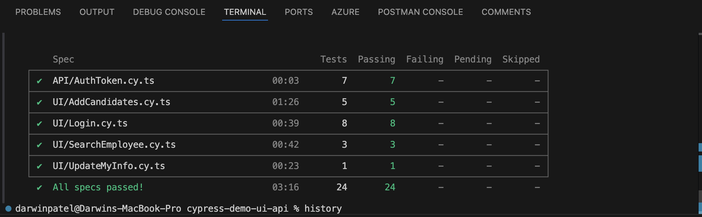

<h1>
 Test automation with <a href="https://cypress.io">  </a> on <a href="https://opensource-demo.orangehrmlive.com/">Demo OrangeHRM</a> & <a href="https://reqres.in/">Req-Res</a>
</h1>



> **Note**
>
> +  **<a href="https://opensource-demo.orangehrmlive.com">Demo OrangeHRM</a>** is a HR system and quite popular for testing advanced concepts
> +  **<a href="https://reqres.in/">Req-Res</a>** is an online site for testing the backend with all the most common REST APIs.
>
## Cypress Features
This tests are purely for Cypress features practice, usage of <a href="https://www.toolsqa.com/cypress/page-object-pattern-in-cypress/">Page Object Model</a> and API testing.


## Getting Started

### Prerequisites

The only requirement for this project is to have [Node.js](https://nodejs.org/en/) installed on your machine. 

### Troubleshooting
If you see an error like "command not found": This means Node.js is not installed or the system's PATH variable is not set correctly.

If you need to install Node.js: You can download and install it from the [official Node.js website](https://nodejs.org/en). Choose the version that matches your operating system.

### Verify nodejs and npm are installed

```shell
node -v
```
>This command will display the installed version of Node.js if it is installed. For example, it might return something like v16.13.0.

```shell
node -v
```
>This will display the installed version of npm if it is present.

## Useful Commands

### 1. Clone repo to local

```shell
git clone https://github.com/darvinpatel/cypress-typescript-demo-ui-api
```

### 2. Install Cypress and Typescript to your DevDependencies

```shell
cd cypress-typescript-demo-ui-api
npm install cypress typescript @types/node @types/cypress --save-dev
```

### 3.1 Verify Cypress

```shell
npx cypress -v
```
>This will display the installed version of cypress like this:
```shell
Cypress package version: 13.14.2
Cypress binary version: 13.14.2
Electron version: 27.3.10
Bundled Node version: 18.17.1
```
### 3.2 Verify Cypress

```shell
npx cypress verify
```
>This used to verify that the Cypress installation is complete and functioning correctly. It would display output as:

```shell
✔  Verified Cypress! /Users/darwinpatel/Library/Caches/Cypress/13.14.2/Cypress.app
```

### 4. Open Cypress

```shell
npx cypress open
```

### 5. Run all tests in Cypress 

```shell
npx cypress run
```
